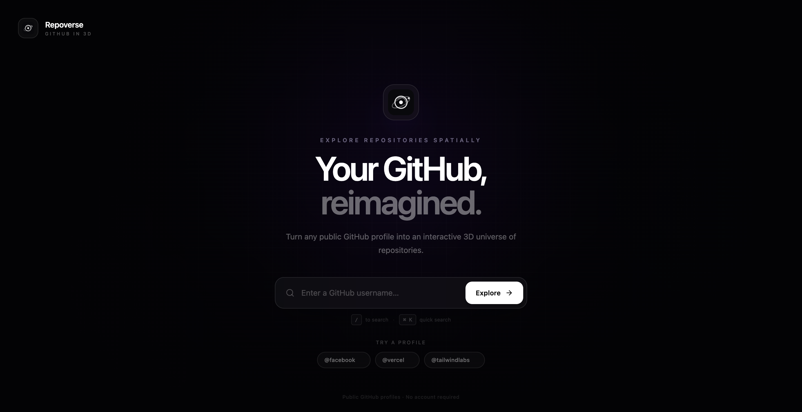

# 🌿 Repoverse

### Design × Development

.˚⊹₊⟡⋆

An interactive 3D GitHub repository explorer built with React and Three.js. Transform public GitHub profiles into immersive universes where repositories become planets, shaped by their language, activity, and popularity.

🟢 **[Live Demo](https://repoverse-delta.vercel.app)**

---

## ✦ Preview

<p align="center">
  
</p>

₊⊹

---

## ✦ About

Repoverse is a browser-based visualization tool designed to turn the familiar structure of GitHub repositories into an interactive spatial experience. Instead of browsing repositories through a conventional list, it transforms a public GitHub profile into a 3D universe where each repository exists as an individual planet.

The experience combines data-driven visual systems with a minimal interface, allowing users to explore repositories through spatial navigation, search, and focused repository details.

₊⊹

---

## ✦ Features

🌱 **3D Repository Universe** • Visualize public GitHub repositories as interactive planets distributed throughout a dynamic 3D space.  
🌱 **Data-Driven Visuals** • Repository language, activity, popularity, and archived status influence planetary appearance and behavior.  
🌱 **Interactive Exploration** • Rotate, zoom, and navigate through the universe to discover repositories in an immersive spatial environment.  
🌱 **Repository Search** • Quickly find repositories by name, description, language, or topic with keyboard shortcut support.  
🌱 **Repository Insights** • Select any planet to reveal focused repository information including stars, forks, language, topics, and GitHub links.  
🌱 **Profile Exploration** • Explore public GitHub profiles with profile statistics, repository counts, followers, languages, and total stars.  
🌱 **Shareable Universes** • Every explored GitHub profile has its own shareable URL for directly revisiting or sharing a repository universe.  

₊⊹

---

## ✦ Tech

 •
 •
 •
 •
 •


₊⊹

---

## ✦ Architecture

```text
repoverse/
├── package.json
├── package-lock.json
├── vercel.json
├── index.html
├── README.md
├── LICENSE
├── public/
│   └── favicon.svg
└── src/
    ├── main.jsx
    ├── App.jsx
    ├── components/
    │   ├── 3d/
    │   │   ├── Universe.jsx
    │   │   └── RepositoryNode.jsx
    │   ├── landing/
    │   │   └── LandingHero.jsx
    │   ├── ProfilePopover.jsx
    │   ├── RepoPanel.jsx
    │   └── ui/
    │       ├── badge.jsx
    │       ├── button.jsx
    │       ├── card.jsx
    │       └── separator.jsx
    ├── lib/
    │   ├── github.js
    │   └── repositoryVisuals.js
    └── data/
        └── repositories.js
```

₊⊹

---

## ✦ Credits

* **Inspiration** • Inspired by the idea of transforming conventional GitHub repository browsing into a more visual and immersive spatial experience.
* **Horizon** • Future iterations may introduce deeper repository analytics, richer universe navigation, and additional ways to visualize GitHub activity.

₊⊹

---

## ✦ Connect

[LinkedIn](https://www.linkedin.com/in/mirepatel) • [Portfolio](https://mirepatel.framer.website/) • [Email](mailto:mirepatel@gmail.com)

---

**C**ode

**C**reativity

**C**ontinuous Learning

•··
